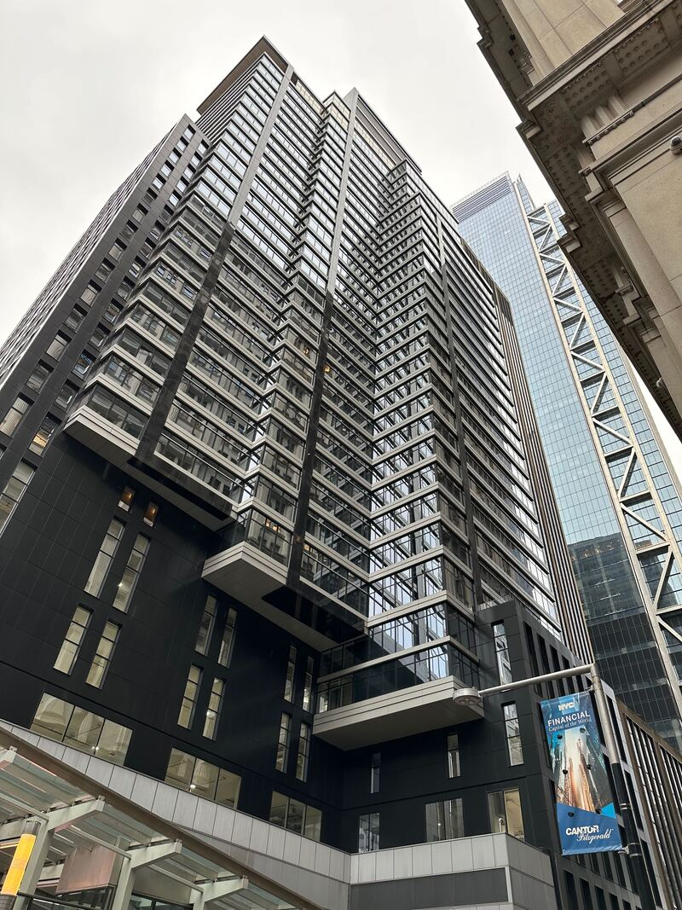

# Kirsch Edge Detector
Compute a map of edges and their directions (dark to bright) from input images using the Kirsch operator.

This script is written in Python (w/ optional CUDA acceleration), and supports colour and greyscaled images of arbitrary dimensions, it is able to process any image format that Pillow supports.

This is an implementation of the algorithm for fun, its structure has no functional resemblance to the University of Waterloo ECE 327 lab project (which is written in VHDL), it is therefore not subject to Policy 71.


## Change Log
| Date | Notes |
| --- | --- |
| 20 Mar. 2024 | Finally implemented CUDA kernel, refactored code to make it slightly less terrible. Added sample images. |
| 22 May 2016 | Added `--threshold` parameter, GPGPU stubs. |
| 20 Jul. 2015 | Initial release. |

## Dependencies
- Python 3
- Pillow (fork of PIL): https://github.com/python-pillow/Pillow
- NumPy
- Scikit-learn: https://scikit-learn.org/
- CuPy (optional - Requires NVIDIA GPU): https://cupy.dev/

## Help Output
```
usage: kirsch.py [-h] [-s suffix] [-a] [-c {mono,sim,fpga}]
                 [-t deriv_threshold] [-r ratio]
                 img_files [img_files ...]

Compute a map of edges and their directions from input images using the Kirsch
operator.

positional arguments:
  img_files

options:
  -h, --help            show this help message and exit
  -s suffix, --suffix suffix
                        a string to append to the end of the input filename
  -a, --accel-gpu       enable GPGPU acceleration through CUDA
  -c {mono,sim,fpga}, --colour {mono,sim,fpga}
                        select the output edge colour mapping, 'sim' and 'fpga'
                        are the ECE 327 colour mappings (default: sim)
  -t deriv_threshold, --threshold deriv_threshold
                        the maximum edge direction derivative threshold
                        (default: 383)
  -r ratio, --resize ratio
                        scaling factor of each input pixel (default: 1)
```

## Samples

### San Tomas Aquino Creek Trail near NVIDIA HQ


### Ueno Station train platform


### NYC Office Skyscraper



### Hummingbird perched on a tree


